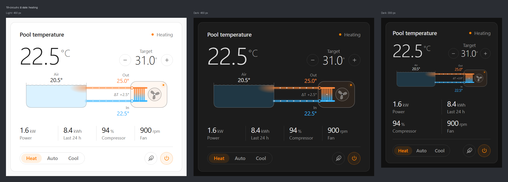
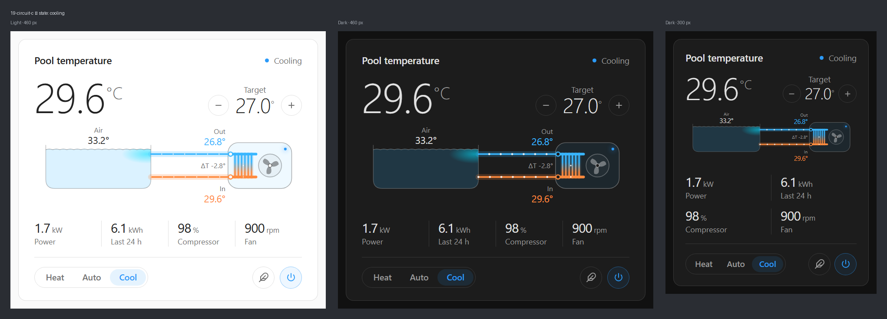
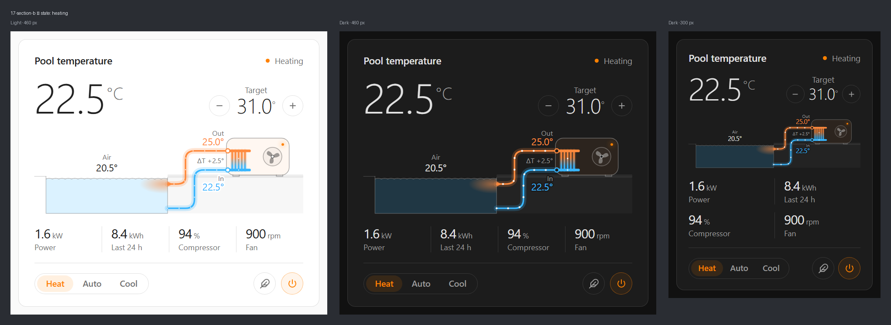
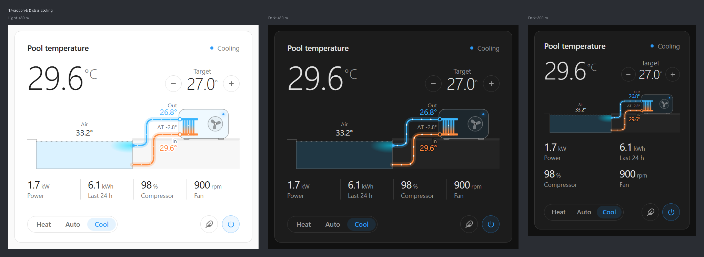
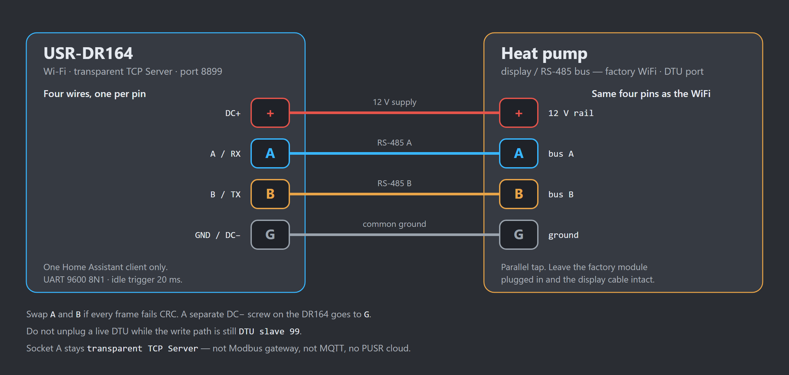
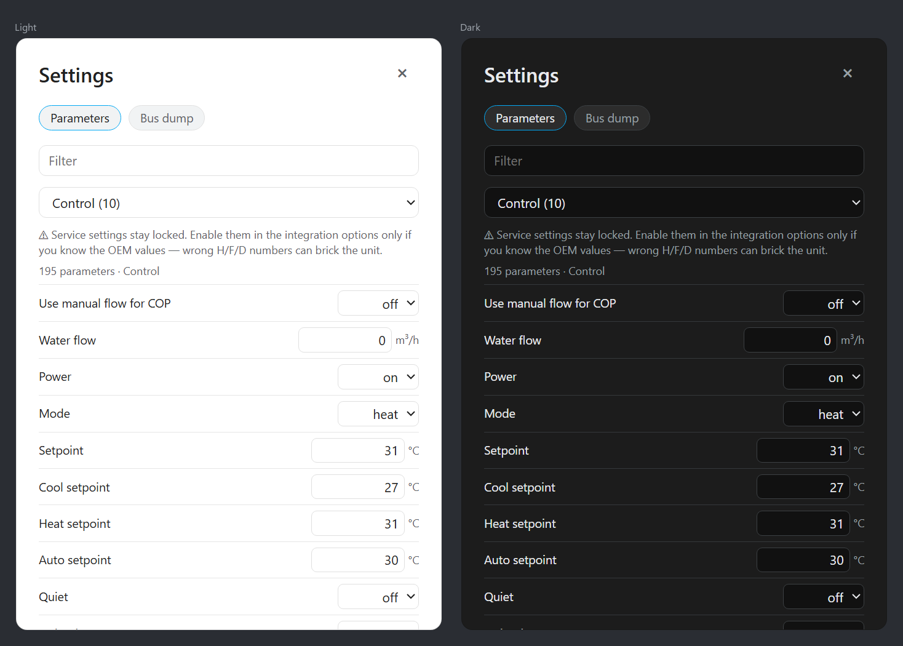
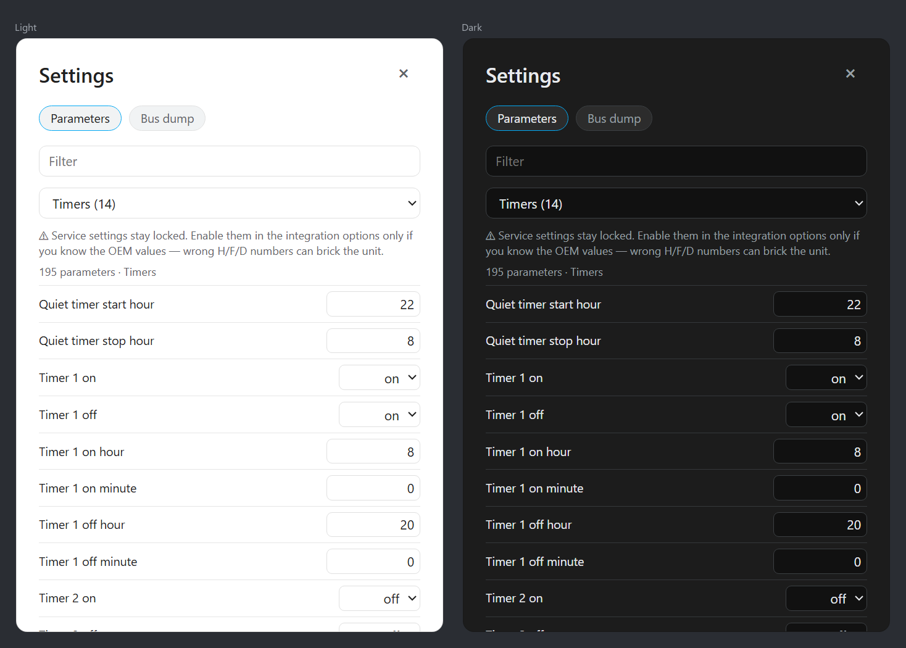
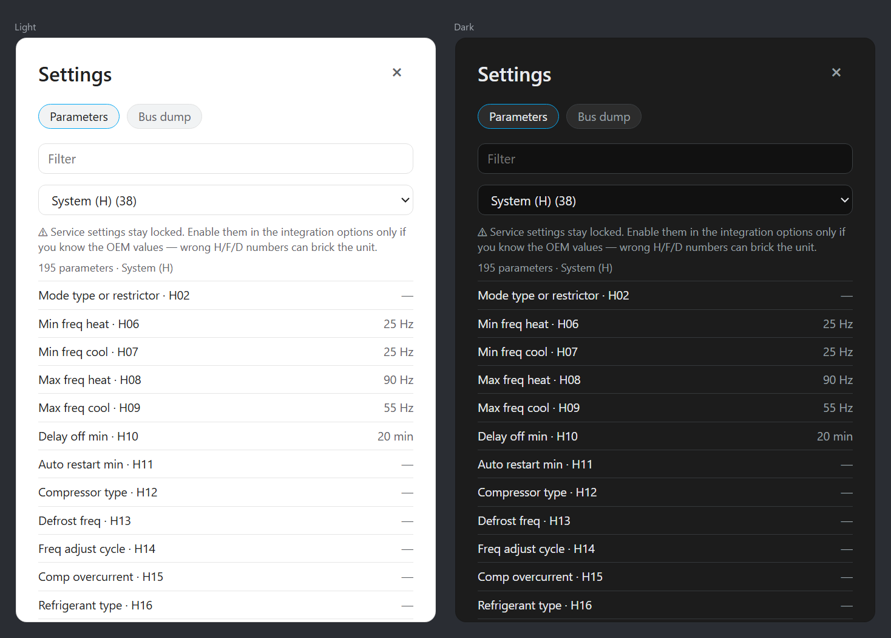
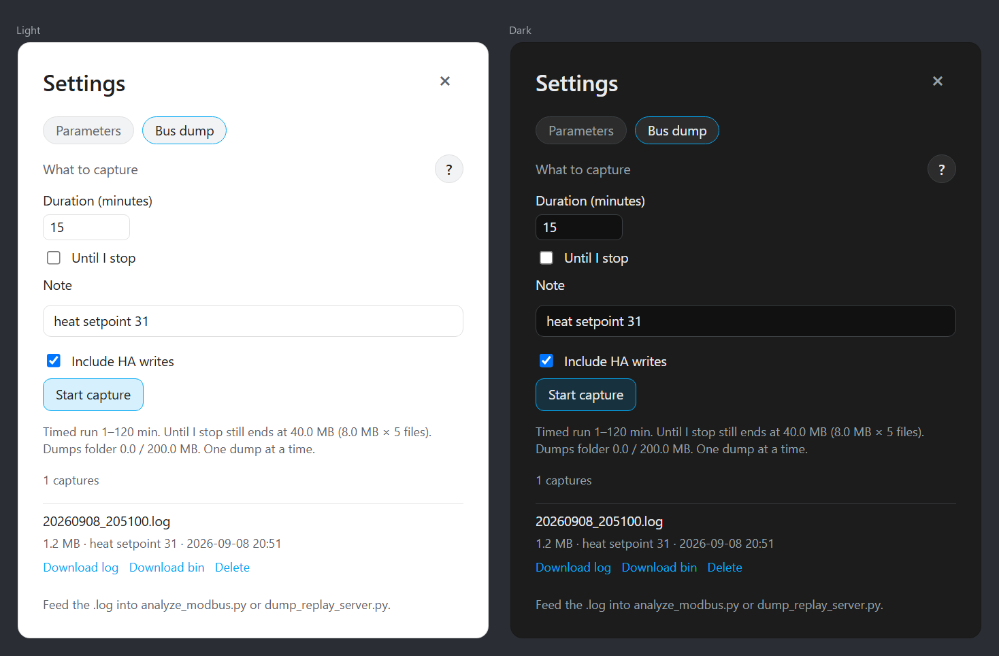

# SPO Pool Heat Pump (Modbus RTU over RS-485 via USR-DR164)

Home Assistant custom integration **SPO Pool Heat Pump (Modbus RTU over RS-485 via USR-DR164)** — inverter pool heat pumps that speak **Modbus RTU on RS-485** (MIDA Cosma / PC1002 verified; Hayward, PHNIX Mini, Fairland community profiles). Transport is a **USR-DR164** in transparent TCP Server mode. This is the Modbus client; do not add Home Assistant’s core Modbus integration.

**SPO** is the product name. GitHub is [@spongioblast](https://github.com/spongioblast). The Home Assistant domain is `spo_pool_heat_pump`. Requires Home Assistant 2025.1 or later.

The integration creates a Device with native `climate`, sensors, switches and timer numbers. Service-menu values are not Home Assistant entities — they live in the card Settings dialog (and an optional standalone settings card). A bundled Lovelace card draws the water path (Circuit or Section — pick one in the card editor).

After HACS install and a restart, this Home Assistant also serves the same walkthrough at **`/spo_pool_heat_pump/setup.html`**.

## What it looks like

Circuit is the default schematic. Section is the cutaway. Both follow the Home Assistant theme (light / dark) and shrink the facts row on a narrow column.

**Circuit — heating**



**Circuit — cooling**



**Section — heating**



**Section — cooling**



## Install the integration

1. HACS → Custom repositories → [https://github.com/spongioblast/spo_pool_heat_pump](https://github.com/spongioblast/spo_pool_heat_pump) → **Integration**.
2. Restart Home Assistant.
3. Wire and configure the DR164 (next three sections), then **Settings → Devices & services → Add integration → SPO Pool Heat Pump**.
4. Host = reserved DR164 IP, port `8899`.

Manual install: copy **only** `custom_components/spo_pool_heat_pump` into `<config>/custom_components/` and restart. Do not copy `tools/`, `tests/`, `ha-docker/`, or `card-src/` — HACS does not install those either.

Profile-author notes: [docs/profiles.md](docs/profiles.md).

## 1. Wire the DR164

The factory WiFi / DTU port already carries all four pins the DR164 needs — **+**, **A**, **B**, **G** — so the DR164 runs in parallel on that same port and takes its power from the pump's 12 V rail. No separate PSU. Four wires, straight across, one per pin. Do not cut the panel cable.



| DR164 | Heat-pump bus |
| --- | --- |
| `DC+` / `+` | `+` — 12 V rail, shared with the WiFi module |
| `A / RX` | `A` |
| `B / TX` | `B` |
| `GND` / `G` | `G` — common ground; a separate `DC−` screw also goes here |

Swap A and B if every frame fails CRC. The DR164 accepts 5–36 V, so the pump's 12 V is in range.

Leave a factory WiFi / DTU module plugged in if you still want writes on slave 99.

## 2. Add the DR164 to the network

1. Phone joins the AP `USR-DR164-xxxx`.
2. Open `http://10.10.100.254` → `admin` / `admin`. Change that password.
3. Set **STA** Wi-Fi to the home SSID. Apply and wait for the reboot onto the LAN.
4. Reserve the DHCP lease (or set a static IP) on the same subnet as Home Assistant.
5. Browse to that reserved IP to finish work-mode setup.

One Home Assistant TCP client only.

## 3. Set the work mode, then add it in Home Assistant

On the DR164 web UI:

- Socket A = **TCP Server**, **transparent**, port **8899**.
- **Not** Modbus gateway, MQTT, HTTP, PUSR cloud, heartbeat, or Event.
- UART **9600 8N1**, idle / time trigger **20 ms**. Length trigger stays 1400.

Then Add integration → SPO Pool Heat Pump → that host and port. Detection listens ~5 s for the 2001×90 broadcast. Write path defaults to **DTU slave 99** when slave 99 is on the bus, otherwise **slave 2**. If the bus does not match a shipped map, pick **Unknown heat pump — dump only** and capture a bus dump from the card Settings. Leave **Allow changing service settings** off (see below).

Serial USB and Modbus-TCP gateways are not available in v1.

If the reserved IP or port changes later, use **Reconfigure** (host and port only). Profile, write path, and H37 stay under **Configure**. Do not add Home Assistant’s core **Modbus** integration (see [Why not Home Assistant’s Modbus integration?](#why-not-home-assistants-modbus-integration)).

## Dashboard card

```yaml
type: custom:spo-pool-heat-pump-card
entity: climate.pool_heat_pump
schematic: circuit    # or section
animation: true       # pipes, plume, surface, and fan; false freezes all motion
settings: true        # sliders icon opens Settings; false hides it
# parameters_groups: [H, F]   # optional: only these service-menu/status groups
```

The sliders icon (next to Quiet and Power) opens Settings. That dialog has every profile register and service-menu value (193 bus rows on the Cosma, 195 in the dialog with the two local COP rows), including timers, plus local **Use manual flow for COP** / **Water flow** (m³/h). Safe writes (power, mode, setpoint, timers, COP flow) edit inline. H/F/D service-menu rows stay locked until the option below is on. Pin the same catalog with `custom:spo-pool-heat-pump-settings-card` if you want it always visible.

COP is drawn under the unit only when it is non-zero: the controller register (2040) if the board publishes one, or a calculated value from the manual flow, ΔT, and electrical power. ΔT stays on the left.

The card is registered automatically via extra JS. Do not add a Lovelace resource for it — HA 2026.9 then fails to define the element and the view shows Configuration error. The panel clock (3015–3017) is read-only — no DTU clock write has been observed.

Example dashboard:

```yaml
views:
  - title: Pool
    cards:
      - type: custom:spo-pool-heat-pump-card
        entity: climate.pool_heat_pump
        schematic: circuit
        animation: true
        settings: true
      - type: custom:spo-pool-heat-pump-settings-card
        entity: climate.pool_heat_pump
      - type: thermostat
        entity: climate.pool_heat_pump
      - type: entities
        entities:
          - switch.pool_heat_pump_quiet
          - sensor.pool_heat_pump_inlet
          - sensor.pool_heat_pump_outlet
          - sensor.pool_heat_pump_energy_total
```

## Writes

Default writes go to **DTU slave 99** when the factory WiFi module is present. Pumps with no DTU use **slave 2** (second-panel responder) after the 1001/1091 pages are seeded (`spo_pool_heat_pump.refresh_service_menu`). PHNIX Mini lists both paths. Writing to the panel at address 1 is unproven.

Fairland CN13 / IPS Pro are polled. Set **Modbus slave (H37)** if the unit is not on the profile default (CN13 50, IPS Pro 1).

| Parameter | Where | What it is |
| --- | --- | --- |
| Host | Add / Reconfigure | Reserved LAN IP of the USR-DR164 |
| Port | Add / Reconfigure | Socket A port (factory `8899`) |
| Profile | Add / Configure | How the unit talks (Cosma, Mini, Hayward, CN13, IPS Pro, or dump only) |
| Write path | Add / Configure | `dtu_99` when the factory WiFi module is on the bus; `slave2` if it is not |
| Modbus slave (H37) | Add / Configure | Fairland poll address. CN13 default 50, IPS Pro usually 1 |
| Poll interval | Add / Configure | Seconds between Fairland polls. Cosma / Mini broadcast and ignore this |
| Allow changing service settings | Add / Configure | Off by default. Required before H/F/D writes |
| Use manual flow for COP | Configure | Local COP from flow × ΔT × power; not written to the bus |
| Water flow (m³/h) | Configure | Circulation used for that COP. `0` means unused |

## Development

This repository also has a state-model simulator, pytest, card source, and a local Docker Home Assistant. They are **not** part of the HACS install.

```bash
python -m tools.simulator --host 0.0.0.0 --port 8899 --profile mida_cosma_pc1002
```

Tests (no Home Assistant required for most of the suite):

```bash
pip install -r requirements_test.txt
pytest
```

HA-dependent tests skip unless `homeassistant` is installed. Dump-replay and Cosma-notebook tests skip unless the sibling lab folder `../protocol-analysis/` is present — that folder is not in this repo and is not published.

Rebuild the Lovelace card after editing `card-src/`:

```bash
cd card-src && npm ci && npm run build
```

Docker: [ha-docker/README.md](ha-docker/README.md). Dump replay (wire-fidelity, not the state model) is lab-only.

## Settings

The sliders icon opens this dialog. Groups, in order:

**Control** — everyday list (power, mode, setpoints, quiet, COP flow):



**Timers** — on/off and quiet windows:



### Service settings

**Allow changing service settings** is an integration option (first-run setup, or later **Configure** on the device). It is off by default. Leave it off unless you know the OEM numbers.

When off, the Settings dialog still *shows* H/F/D (and other special-menu) values but will not write them. When on, those rows become editable and the first write in a session asks for confirmation. Wrong H, F, or D values can damage or brick the heat pump — compressor limits, EEV, defrost, and similar installer parameters. Safe everyday writes (power, mode, setpoint, quiet, timers) do not need this option.

**System (H)** — the special / service menu. Values are visible; writes stay locked until the option is on:



### Bus dump

A dump is a raw copy of the RS-485 bytes Home Assistant sees on the DR164. Use it to map a new model or an unknown register. Sliders icon → Settings → **Bus dump** (or `spo_pool_heat_pump.start_dump`). Files land in `config/spo_pool_heat_pump_dumps/*.log`. Timed runs are 1–120 min; Until I stop still ends at ~40 MB. The folder refuses a new capture above ~200 MB.



The **?** on that tab is the full checklist. In short:

1. Start the capture first. Write in the note what you are about to do.
2. One action at a time; wait a few seconds.
3. Use the heat-pump panel **and** the phone app if both exist. Leave the factory WiFi / DTU plugged in.
4. Power, Heat/Cool/Auto and each mode’s setpoint, quiet/timers, every on-screen menu. Let the unit actually run.
5. After each change, screenshot the app or photo the panel (menu name and value). Name files with clock time or the dump note.
6. Download the `.log` and keep the pictures with it.

Do not change H/F/D service values unless you know the OEM numbers.

## Actions

These are integration actions (`spo_pool_heat_pump.*`). The card Settings dialog covers dump and service-menu work for everyday use.

### Start bus dump

`spo_pool_heat_pump.start_dump` captures raw RS-485 bytes from the DR164.

| Field | Required | Description |
| --- | --- | --- |
| `duration` | no | Seconds. `0` runs until the ~40 MB cap or Stop. Default 900 |
| `note` | no | Stored in the dump header (what you are about to do) |
| `include_writes` | no | Also record bytes Home Assistant sends. Default on |
| `entry_id` / `device_id` | no | Which heat pump, if more than one |

### Stop bus dump

`spo_pool_heat_pump.stop_dump` closes the running capture.

| Field | Required | Description |
| --- | --- | --- |
| `entry_id` / `device_id` | no | Which heat pump, if more than one |

### Refresh service menu

`spo_pool_heat_pump.refresh_service_menu` does a one-shot read of the service-menu pages (1001 / 1091 / 1181). Needed on slave-2 setups before those rows populate.

| Field | Required | Description |
| --- | --- | --- |
| `entry_id` / `device_id` | no | Which heat pump, if more than one |

### Set service setting

`spo_pool_heat_pump.set_service_menu` writes one H/F/D (or other special-menu) key. **Allow changing service settings** must be on. Wrong values can damage the unit.

| Field | Required | Description |
| --- | --- | --- |
| `key` | yes | Parameter id, e.g. `h06_min_freq_heat` |
| `value` | yes | New value |
| `entry_id` / `device_id` | no | Which heat pump, if more than one |

## Why not Home Assistant’s Modbus integration?

The heat pump **is** Modbus RTU. We still do not use Core’s **Modbus** integration (and do not set the DR164 to **Modbus gateway**).

Core Modbus — and gateway mode on the DR164 — assume Home Assistant is the only master: poll a slave, get a reply. On Cosma / PC1002 the **display already masters** the line. The outdoor board **broadcasts** the 2001×90 map; this integration **listens**. Writes go to **DTU slave 99**, or Home Assistant **answers as slave 2** when the board polls. A second poller on the same RS-485 would collide with that.

The DR164 must stay a **transparent TCP byte pipe** (raw RTU, 20 ms idle framing). Core Modbus-over-TCP wants MBAP / gateway framing. This client also drops non-CRC noise (heartbeat) and waits for a quiet gap before TX.

Fairland CN13 / IPS Pro *are* polled, but still through this client so one integration, one socket, and the same write / dump / card path. Do not add both.

## Remove the integration

**Settings → Devices & services → SPO Pool Heat Pump → Delete.** The device and its entities go with the entry.

Files in `config/spo_pool_heat_pump_dumps/` are not deleted. Remove those captures yourself if you no longer want them.

## Troubleshooting

| Symptom | What to try |
| --- | --- |
| Cannot connect / add-integration fails | Reserved IP, Socket A = TCP Server on 8899, pump powered. Then swap RS-485 A/B |
| Every frame fails CRC / no broadcast | Swap A and B. Confirm UART 9600 8N1 and idle 20 ms |
| Already configured | This DR164 (or this serial) already has an entry. Open that one, or **Reconfigure** its host/port |
| Entities unavailable | One HA client only on port 8899. If the IP changed, **Reconfigure**. Cosma needs the 2001 broadcast; Fairland needs H37 |
| Dump folder full | `config/spo_pool_heat_pump_dumps/` is over ~200 MB. Delete old `.log` / `.bin` from the card dump list |
| Writes do nothing | Write path: DTU slave 99 only with the WiFi module present. No DTU → slave 2. Dump-only never writes |
| Service-menu write refused | Enable **Allow changing service settings** under Configure |
| Core Modbus / DR164 “Modbus gateway” | Do not add those. See [Why not Home Assistant’s Modbus integration?](#why-not-home-assistants-modbus-integration) |

## License

MIT. See [LICENSE](LICENSE). Releases: [CHANGELOG.md](CHANGELOG.md). Use at your own risk on a live RS-485 bus. One HA writer. Listen-only first.
