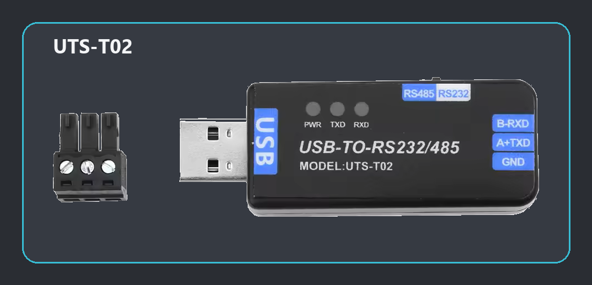
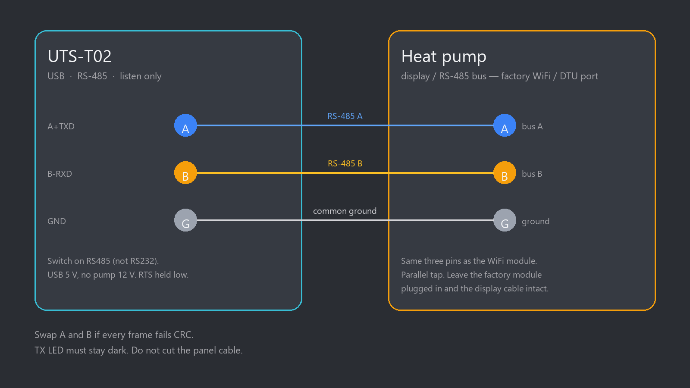

# RS-485 ModBus dump

Use this when a heat pump is not in the integration yet, or when Home Assistant’s **Bus dump** is not enough (HA is a bus participant; this is a listen-only tap of the wires).

Plug a **UTS-T02** onto the factory RS-485 / WiFi port, run `dump.py`, then work the panel and the phone app. You get a timestamped hex log of every burst and idle gap. That file is what we need to map registers and add a profile. If the bytes are Modbus RTU, the tool also prints decoded frames and `analyze.py` can summarize slaves and function codes. If they are not Modbus, keep the `.log` anyway — hex is still the protocol.

This is not the Home Assistant plugin. HACS does not install it. The tool never transmits.

`dump.py` alone is the capture. `analyze.py` is optional and can be run later on the same file. The log does not invent register names.

## What you need

- A USB **RS-485** adapter (A / B / GND). We use a **UTS-T02** (CH343G). Cheap sticks with the same pinout also work — the tool picks them up automatically:
  - Generic AliExpress / Amazon **USB to RS485** (usually **CH340**)
  - **Waveshare USB TO RS485** (CH343 or FT232)
  - **DSD TECH** USB-RS485 (CH340 or FT232)
- Not a USB-TTL / USB-UART with only TX and RX. Must be differential RS-485.
- Python 3
- `pip install -r tools/rs485-dump/requirements.txt`

If the stick has an RS232 / RS485 switch, set it to **RS485**. `--port COMx` if more than one dongle is plugged in.



## Wire the UTS-T02

The factory WiFi / DTU port has the same **A**, **B**, **G** as the display bus. Three wires. The dongle is USB-powered — do not take the pump’s 12 V. Do not cut the panel cable. Leave any 120 Ω terminator **off** if the wired panel is still connected. Same A / B / G on a CH340 or Waveshare stick.



| UTS-T02 | Heat-pump bus |
| ------- | ------------- |
| `A+TXD` | `A`           |
| `B-RXD` | `B`           |
| `GND`   | `G`           |

Swap A and B if the hex is a smear or every frame fails CRC. RX should blink on a live bus; TX must stay dark (this tool never sends).

## Start

```
tools\rs485-dump\dump.cmd
```

or

```
python tools/rs485-dump/dump.py
```

Port is found automatically (UTS-T02 first). Baud starts at **9600**. A quiet few seconds is normal — the tool does not guess baud from silence. If the hex is a smear it will try 4800 and 19200, or tell you to flip the switch to RS485.

```
python tools/rs485-dump/dump.py --note "Fairland CN13 heat 30"
python tools/rs485-dump/dump.py --baud 4800
python tools/rs485-dump/dump.py --list-ports
python tools/rs485-dump/dump.py --probe-baud
python tools/rs485-dump/analyze.py dumps/20260914_190628.log
```

`--probe-baud` scores on purpose (touch the panel if the bus is idle). `--baud` locks one rate. Files land in `tools/rs485-dump/dumps/<stamp>.log` and `.bin`.

## Defaults

Same names as the block at the top of `dump.py`. Change them there if the pump is already known, or pass `--baud` for one run.

| Name | Default | Meaning |
| --- | --- | --- |
| `DEFAULT_BAUD` | 9600 | Most PHNIX / Hayward / Cosma boards. Poolstar cousins are 4800. |
| `DEFAULT_DATA_BITS` | 8 | |
| `DEFAULT_PARITY` | N | N / E / O |
| `DEFAULT_STOP_BITS` | 1 | |
| `DEFAULT_GAP_S` | 0.020 | Idle that starts a new `.log` chunk |
| `PROBE_BAUDS` | 9600, 4800, 19200 | Tried only after real bytes look like noise |
| `SCORE_AFTER_BYTES` | 64 | Do not judge the stream until this many RX bytes |

## How to capture

Do this in order.

1. **Set the serial values** if you already know them. Defaults at the top of `dump.py` are **9600 8N1** (see [Defaults](#defaults)). Change them there, or pass `--baud` for one run (Poolstar cousins are often **4800**). Leave the defaults if you do not know — a smear later will try 4800 and 19200.
2. **Dongle switch on RS485**, not RS232. Wrong switch looks like a live bus but the hex is garbage. Terminator **off** if the wired panel is still connected.
3. **Start the dump.** Optional `--note` what you are about to do.

```
tools\rs485-dump\dump.cmd
```

or `python tools/rs485-dump/dump.py`. RX should blink on a live bus; TX must stay dark. A quiet few seconds is normal.

4. **Then work the pump** (below). One action at a time. Wait until the **unit** responds — not only until you tapped. A setpoint or mode can take a few seconds; compressor start, a full warmup, or idle after a high kick can take a minute. Leave the factory WiFi / DTU plugged in if the pump has one.

### Phone app (prefer this if you have WiFi)

Many inverter pool pumps use **Handy Heat Pump** or **AquaTemp** (same OEM family). Fairland-style units often use **InverGo**. Whatever is on the phone is fine.

If the WiFi module is fitted and you change everything from the app, **phone screenshots are enough** for those actions — you do not need a photo of the wired display as well.

Screenshot every screen after each change, and also the pages you only *open*:

- Home: power, mode, target, water in/out, ambient, running / idle
- Timers, quiet / silence, boost if it exists
- Device / about: model, serial, MAC, firmware / display / main-board codes
- Any parameter, engineer, or “special” list — **every row of values**, even if you do not change them

Name files with clock time or the dump note so they line up with the `.log`.

### Special menus (do this even if you only use the app)

The deep settings often live behind a short code. On PHNIX-family boards (Cosma, Hayward, Fairland H-menu, many Handy / AquaTemp units) the wired display is usually: hold **Mode ~10 s**, then type a code. Other brands use Settings, a swipe, or a 4-digit field. Some apps ask for the same codes on a parameter page.

Try the booklet first. If it does not say, these are the usual ones — a wrong code just goes back to `000`:

| Code | Typical menu | Common on |
| ---- | ------------ | --------- |
| `022` | Customer / user (H, timers, address) | PHNIX, AquaTemp, Handy, Hayward, Fairland |
| `066` | Factory / special (H, F, D, …) | Same family (Cosma used this) |
| `168` | User / system parameters | Later color-screen inverters (many no-name / “IoT” manuals) |
| `0814` | System parameter list | Some 4-digit menus (PoolUp-style and cousins) |
| `1234` / `0000` | Installer or first-run PIN | A few European badges |

Do **not** enter restore-factory codes (e.g. `400866` on some color screens) — that wipes the unit, it is not a dump.

Open every page and **screenshot all current values**. Do not change compressor, EEV, defrost, or other installer numbers unless you know the OEM defaults — those can damage the unit. Photographing / screenshotting the list as it is is what we need.

### What to run through

- Power on and off
- Heat, Cool, Auto — then each mode’s own setpoint
- Quiet / silence, on/off timers
- Every on-screen menu (H, F, D, E, P, R, timers — whatever yours has)
- Let the unit **actually run**: water-pump pre-run, compressor start, heat (and cool if it can). Do not wait for the water to reach the target — that can take hours. A short tap that never starts the compressor is a weak dump.
- Optional but useful: a **real fault**. If there is a flow sensor, stop the water briefly (close a valve or kill the filter pump), wait for the error on the panel/app, screenshot the code, restore flow. Same idea for other safe, reversible faults.

### Send

The `.log` plus every screenshot / panel photo. Do not commit dumps.

## Reading output

Hex is always valid. A line starting `RTU` appears only when a chunk is CRC-valid Modbus. Few CRC hits means “not Modbus RTU (or wrong baud)” — keep the `.log`. `analyze.py` prints slaves, polls, writes, and chunk sizes; if there are no CRC frames it says so and still reports the hex stats.
